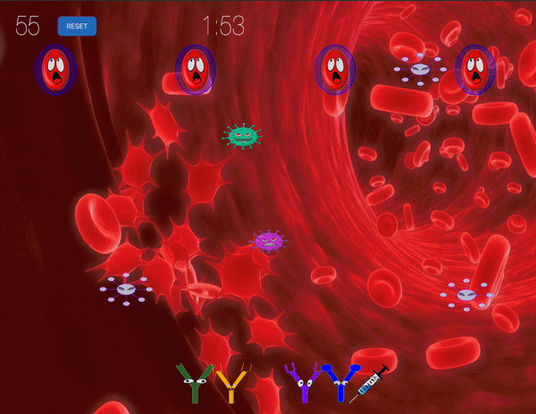

# WWDC_21
Swift Student Challenge

## Features 
*Sprite Nodes:* 
* Blood Cells (x4)
* Antibodies (x4) 
* Vaccine (x1) 
* Coronavirus (x1)
* Antigens (x4-5 per frame, x5 different in total) 

## HOW TO PLAY THE GAME

### Score Points - 
* In order to score points you must matches the antibody with the antigen or the vaccine to the coronavirus. Killing an antigen will score you 15 points. 
* Destorying a coronavirus will score you 20 points. Move the vaccines and antibodies by clicking and dragging. 

### Losing Points -
* You will lose points if you connect the coronavirus hits the blood cells. 

### Antigens -
* There are 4 different antigens. Each antigen has a specific epitope and different color. 
* The Epitope and the color must match the antibody in order to get rid of the antigen. 
* After killing one antigen, another will reappear. Antigens won't lose you any points if you hit the bloodCell but will give you some points if you kill it with an antibody

### Antibody -
* There are 4 different antibodies for each antigen. The colors are similar to virus. The paratope of the antibody must match with the epitope of the antigen to kill it 

### Coronavirus + Vaccine -
* The coronavirus are the viruses more than 8  Both purple and teal. They are the most dangerous virus and can only be killed by the vaccines. If the coronavirus hits the bloodCell you will lose 15 points. 

### Antibody Combination -
* You can combine the antibodies and vaccines together to create a super antibody that can destroy any of the viruses with which antibodies you have combined. For example if you combine the blue antibody and the vaccine, you can kill a coronavirus and the blue antigen. 

### How to Win - 
* You can win the game by scoring 500 points. If you score 500 or more before the two minutes are up than you will win the game. But you must have more than 500 points as soon as time is up

### How to Lose - 
* You will lose if you have less than 500 points at the end of the two minutes. 

### Other Notes - 
* The antigen speed will increase after a certain number of points. 

* Click the Reset button to place the antibodies back in the original positions. 

* You start with 50 points

## ABOUT THE AUTHOR
Sneha Mahapatra is a recent graduate of Purdue University and is now a graduate student at the University of Massachusetts, Amherst where she plans on becoming a software engineer with interest in Artifical Intelligence, Neural Nets, and Computer Vision. 
